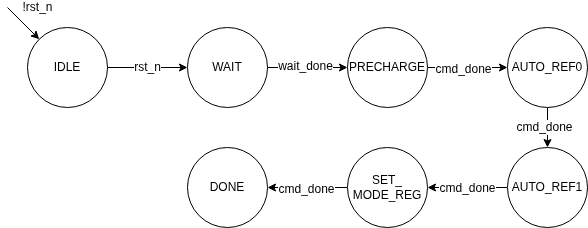
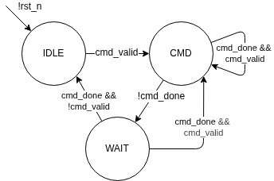

# SDRAM Implementation

This document describes the SDRAM implementation.

- [SDRAM Implementation](#sdram-implementation)
  - [Parameter](#parameter)
    - [Global Parameter](#global-parameter)
    - [SDRAM Size](#sdram-size)
    - [SDRAM Timing](#sdram-timing)
  - [Interface](#interface)
    - [Clock and Reset](#clock-and-reset)
    - [System Bus](#system-bus)
  - [Block Diagram](#block-diagram)
  - [RTL files](#rtl-files)
  - [Implementation](#implementation)
    - [sdram\_controller](#sdram_controller)
    - [sdram\_init](#sdram_init)
    - [sdram\_cmd](#sdram_cmd)
    - [sdram\_ctrl](#sdram_ctrl)


## Parameter

### Global Parameter

| Parameter  | Default | Unit | Description       |
| ---------- | ------- | ---- | ----------------- |
| `CLK_FREQ` | 100     | MHz  | Clock frequency   |
| `AW`       | 24      | bit  | Bus Address width |
| `DW`       | 16      | bit  | Bus Data width    |

### SDRAM Size

| Parameter | Default | Unit | Description                |
| --------- | ------- | ---- | -------------------------- |
| `RAW`     | 12      | bit  | SDRAM Address width        |
| `CAW`     | 9       | bit  | SDRAM Column address width |


### SDRAM Timing
| Parameter | Default | Unit | Description                                                |
| --------- | ------- | ---- | ---------------------------------------------------------- |
| `tRAS`    | 37      | ns   | ACTIVE-to-PRECHARGE command                                |
| `tRC`     | 60      | ns   | ACTIVE-to-ACTIVE command period                            |
| `tRCD`    | 15      | ns   | ACTIVE-to-READ or WRITE delay                              |
| `tRFC`    | 66      | ns   | AUTO REFRESH period                                        |
| `tRP`     | 15      | ns   | PRECHARGE command period                                   |
| `tRRD`    | 14      | ns   | ACTIVE bank A to ACTIVE bank B command                     |
| `tWR`     | 15      | ns   | WRITE recovery time (WRITE completion to PRECHARGE period) |
| `tREF`    | 64      | ms   | Refresh period                                             |


## Interface

### Clock and Reset

| Signal  | Direction | Width | Description      |
| ------- | --------- | ----- | ---------------- |
| `clk`   | input     | 1     | Clock            |
| `rst_n` | input     | 1     | Active-low reset |

### System Bus

The system bus is divided into 2 channels. **request** and **response** channels.

#### Request Channel

| Signal                | Direction | Width | Description                         |
| --------------------- | --------- | ----- | ----------------------------------- |
| `bus_req_valid`       | input     | 1     | Request valid                       |
| `bus_req_write`       | input     | 1     | 0 = read request, 1 = write request |
| `bus_req_addr`        | input     | AW    | Address                             |
| `bus_req_wdata`       | input     | DW    | Write data                          |
| `bus_req_byteenable`  | input     | DW/8  | Byte enable                         |
| `bus_req_ready`       | output    | 1     | Request ready                       |
| `bus_rsp_early_valid` | output    | 1     | One cycle before read data valid    |
| `bus_rsp_valid`       | output    | 1     | Read data valid                     |
| `bus_rsp_rdata`       | output    | DW    | Read data                           |

#### Response Channel

| Signal                | Direction | Width | Description                      |
| --------------------- | --------- | ----- | -------------------------------- |
| `bus_rsp_early_valid` | output    | 1     | One cycle before read data valid |
| `bus_rsp_valid`       | output    | 1     | Read data valid                  |
| `bus_rsp_rdata`       | output    | DW    | Read data                        |

## Block Diagram


## RTL files

| File                            | Description                |
| ------------------------------- | -------------------------- |
| `rtl/sdram/sdram_controller.sv` | SDRAM controller top level |
| `rtl/sdram/sdram_init.sv`       |                            |
| `rtl/sdram/sdram_cmd.sv`        |                            |
| `rtl/sdram/sdram_ctrl.sv`       |                            |

## Implementation

### sdram_controller

This is the top level that instantiate all the sub components including: `sdram_init`, `sdram_cmd`, and `sdram_ctrl`.

A mux is used to select the command from `sdram_init` and `sdram_ctrl` to `sdram_cmd`. During initialization phase,
the command is selected from `sdram_init`. Once the initialization is done, the command is selected from `sdram_ctrl`

### sdram_init

#### Interface

| Signal             | Direction | Width | Description                           |
| ------------------ | --------- | ----- | ------------------------------------- |
| `clk`              | input     | 1     | Clock                                 |
| `rst_n`            | input     | 1     | Active-low reset                      |
| `cfg_burst_length` | input     | 3     | SDRAM Mode register: Burst Length     |
| `cfg_burst_type`   | input     | 1     | SDRAM Mode register: Burst Type       |
| `cfg_cas_latency`  | input     | 3     | SDRAM Mode register: CAS Latency      |
| `cfg_burst_mode`   | input     | 1     | SDRAM Mode register: Write Burst Mode |
| `init_valid`       | output    | 1     | Initialization command valid          |
| `init_cmd`         | output    | 4     | Initialization command code           |
| `cmd_done`         | input     | 1     | Command completion flag               |
| `init_done`        | output    | 1     | Initialization process done           |


#### Implementation

SDRAM must be initialized properly after powered up before it can operate.

Here is the power-up sequence used in this design:

1. Apply power to SDRAM and hold CKE low.
2. Provide stable SDRAM clock signal.
3. Bring CKE HIGH and then wait at least 100us prior to issuing any command except **COMMAND INHIBIT** or **NOP**.
4. Perform a **RECHARGE ALL** command and wait for its completion.
5. Perform an **AUTO REFRESH** command and wait for its completion.
5. Perform an **AUTO REFRESH** command and wait for its completion.
6. Perform a **Load Mode Register** Command and wait for its completion.
7. SDRAM is ready for operation.

##### SDRAM Init State Machine

A SDRAM init state machine controls the initialization sequence.

**State Definition**

```verilog
// SDRAM Initialization State Machine
typedef enum logic [3:0] {
    IDLE,          // start up idle state
    WAIT,          // wait at least 100us
    PRECHARGE,     // perform: precharge all the bank
    AUTO_REF0,     // perform: First Auto refresh
    AUTO_REF1,     // perform: Second Auto refresh
    SET_MODE_REG,  // perform: Set mode register
    DONE           // Initialization done
} init_state_t;
```
**State Diagram**



**State Transition**

The SDRAM init state machine follows the initialization sequence.

- In the **WAIT** state, an `init_cnt` counter measures the 100 µs delay required after power-up.
- In each state, the corresponding SDRAM commands are send to the `sdram_cmd`

### sdram_cmd

#### Parameter

| Parameter  | Default | Unit | Description                                                |
| ---------- | ------- | ---- | ---------------------------------------------------------- |
| `CLK_FREQ` | 100     | MHz  | Clock frequency                                            |
| `AW`       | 12      | bits | SDRAM address width                                        |
| `DW`       | 16      | bits | SDRAM data width                                           |
| `tRAS`     | 37      | ns   | ACTIVE-to-PRECHARGE command                                |
| `tRC`      | 60      | ns   | ACTIVE-to-ACTIVE command period                            |
| `tRCD`     | 15      | ns   | ACTIVE-to-READ or WRITE delay                              |
| `tRFC`     | 66      | ns   | AUTO REFRESH period                                        |
| `tRP`      | 15      | ns   | PRECHARGE command period                                   |
| `tRRD`     | 14      | ns   | ACTIVE bank A to ACTIVE bank B command                     |
| `tWR`      | 15      | ns   | WRITE recovery time (WRITE completion to PRECHARGE period) |
| `tREF`     | 64      | ms   | Refresh period                                             |

#### Interface

##### Clock and Reset

| Signal  | Direction | Width | Description      |
| ------- | --------- | ----- | ---------------- |
| `clk`   | input     | 1     | Clock            |
| `rst_n` | input     | 1     | Active-low reset |

##### Command Input/Output

| Signal      | Direction | Width | Description               |
| ----------- | --------- | ----- | ------------------------- |
| `cmd_valid` | input     | 1     | Command valid             |
| `cmd_type`  | input     | 4     | Command type (read/write) |
| `cmd_addr`  | input     | AW    | Address                   |
| `cmd_data`  | input     | DW    | Write data                |
| `cmd_done`  | output    | 1     | Command complete          |

##### SDRAM Interface

| Signal        | Direction | Width | Description                        |
| ------------- | --------- | ----- | ---------------------------------- |
| `sdram_cke`   | output    | 1     | Clock enable                       |
| `sdram_cs_n`  | output    | 1     | Chip select (active low)           |
| `sdram_ras_n` | output    | 1     | Row address strobe (active low)    |
| `sdram_cas_n` | output    | 1     | Column address strobe (active low) |
| `sdram_we_n`  | output    | 1     | Write enable (active low)          |
| `sdram_addr`  | output    | AW    | Address                            |
| `sdram_ba`    | output    | 2     | Bank select                        |
| `sdram_dqm`   | output    | DW/8  | Data mask                          |
| `sdram_dq`    | inout     | DW    | Data input/output bus              |

#### Implementation

This modules receives command from `sdram_ctrl`, generate the corresponding sdram command, and send it to the sdram chip.

Each sdram command need to meet the corresponding timing. The timing is specified as parameter (`tXXX`) to the module
in terms of nano-second. The timing is then converted to number of clock cycles (`cXXX`) based on the clock frequency.
If the command need more than one cycle, the command is send on the first cycle, and the NOP is send on the subsequent
cycles till the command has need the timing requirement.

A simple state machine is used to control the logic.

##### Command State Machine

**State Definition**

```verilog
// SDRAM Initialization State Machine
typedef enum logic [3:0] {
    IDLE,          // IDLE state, no command to send.
    CMD,           // Send the command to the SDRAM chip.
    WAIT,          // Wait for the command timing.
} cmd_state_t;
```
**State Diagram**



##### Key SDRAM timing

| Timing | Description                                                |
| ------ | ---------------------------------------------------------- |
| `tRAS` | ACTIVE-to-PRECHARGE command                                |
| `tRC`  | ACTIVE-to-ACTIVE command period                            |
| `tRCD` | ACTIVE-to-READ or WRITE delay                              |
| `tRFC` | AUTO REFRESH period                                        |
| `tRP`  | PRECHARGE command period                                   |
| `tRRD` | ACTIVE bank a to ACTIVE bank b command                     |
| `tRW`  | WRITE recovery time (WRITE completion to PRECHARGE period) |

### sdram_ctrl

#### Parameter

| Parameter  | Default | Unit | Description                                 |
| ---------- | ------- | ---- | ------------------------------------------- |
| `CLK_FREQ` | 100     | MHz  | Clock frequency                             |
| `AW`       | 24      | bits | Bus address width (should match SDRAM size) |
| `DW`       | 16      | bits | Bus data width                              |
| `RAW`      | 12      | bits | SDRAM address width                         |
| `CAW`      | 9       | bits | SDRAM column address width                  |
| `tREF`     | 64      | ms   | Refresh period                              |

#### Interface

| Signal  | Direction | Width | Description      |
| ------- | --------- | ----- | ---------------- |
| `clk`   | input     | 1     | Clock            |
| `rst_n` | input     | 1     | Active-low reset |

##### Initialization Status

| Signal      | Direction | Width | Description         |
| ----------- | --------- | ----- | ------------------- |
| `init_done` | input     | 1     | Initialization done |

##### Command Input/Output

| Signal      | Direction | Width | Description             |
| ----------- | --------- | ----- | ----------------------- |
| `cmd_valid` | output    | 1     | Command valid           |
| `cmd_type`  | output    | 4     | Command type            |
| `cmd_addr`  | output    | AW    | Command address         |
| `cmd_data`  | output    | DW    | Command data            |
| `cmd_done`  | input     | 1     | Command completion flag |

##### SDRAM Config

| Signal             | Direction | Width | Description                           |
| ------------------ | --------- | ----- | ------------------------------------- |
| `cfg_burst_length` | input     | 3     | SDRAM Mode register: Burst Length     |
| `cfg_burst_type`   | input     | 1     | SDRAM Mode register: Burst Type       |
| `cfg_cas_latency`  | input     | 3     | SDRAM Mode register: CAS Latency      |
| `cfg_burst_mode`   | input     | 1     | SDRAM Mode register: Write Burst Mode |

##### System Bus

| Signal            | Direction | Width | Description                         |
| ----------------- | --------- | ----- | ----------------------------------- |
| `req_valid`       | input     | 1     | Request valid                       |
| `req_write`       | input     | 1     | 0 = read request, 1 = write request |
| `req_addr`        | input     | AW    | Address                             |
| `req_wdata`       | input     | DW    | Write data                          |
| `req_byteenable`  | input     | DW/8  | Byte enable                         |
| `req_ready`       | output    | 1     | Request ready                       |
| `rsp_early_valid` | output    | 1     | One cycle before read data valid    |
| `rsp_valid`       | output    | 1     | Read data valid                     |
| `rsp_rdata`       | output    | DW    | Read data                           |

#### Implementation

This module is the heart of the sdram controller:
  - It receives the request from the host and send the commands to the `sdram_cmd` module.
  - It receives the read data from the sdram and send it back to the host.
  - It keep track of the refresh interval and send refresh command to the `sdram_cmd`.

This design support the following features:

  - Single read and write request (burst support will come later)
  - Manual pre-charge control. Once a bank/row is opened, it will keep opening till
    - A new request targeting a different bank/row.
    - Refresh is due.
  - Pipelined design.

##### System Bus

To simply the design and decouple waiting for the read data for the request, the system bus is divided into 2 channels:
request channel (`req_*`) and response channel (`rsp_*`).

The request from the host will be send at the request channel, and read data will be sent back through the response channel.

To achieve better timing, the incoming bus requests are first registered before consumed by the internal logic.
Similarly, the read data from the SDRAM is also registered before sending back to the host.

With the 2 channel bus design, it can be easily converted to other industrial standard bus protocol such as `wishbone`

##### SDRAM control state machine

The sdram_ctrl implement the SDRAM control state machine to control the sdram.

#### State Definition in RTL

```verilog
typedef enum logic [3:0] {
    RESET,              // Start up State
    INIT,               // SDRAM initialization
    MODE_REG_SET,       // Mode Register set
    IDLE,               // IDLE state (after bank have been pre-charged)
    ACTIVE,             // Active a row
    WRITE,              // Write without auto precharge
    READ,               // Read without auto precharge
    PRECHARGE,          // Precharge the bank
    AUTO_REFRESH        // Auto Refresh
} sdram_state_t;
```

**State Transition Diagram**


**States and Transitions**

- RESET: Entered when the system is reset.

    | Next state | Condition                           |
    | ---------- | ----------------------------------- |
    | INIT       | `rst_n == 1` (reset de-assertiddon) |

- INIT: Performs SDRAM initialization sequence.

    | Next state | Condition        |
    | ---------- | ---------------- |
    | IDLE       | `init_done == 1` |


- IDLE: Waits for a request or refresh is due.

    | Next state | Condition                                             |
    | ---------- | ----------------------------------------------------- |
    | ACTIVE     | `!refresh_due` AND `req_valid_q` AND `row_precharged` |
    | WRITE      | `!refresh_due` AND `req_write_q` AND `!open_new_row`  |
    | READ       | `!refresh_due` AND `req_read_q` AND `!open_new_row`   |
    | PRECHARGE  | `refresh_due` OR (`req_valid_q` AND `open_new_row`)   |


- ACTIVE: Issues a ROW ACTIVE command to activates the appropriate SDRAM row for read/write access.

    | Next state | Condition                    |
    | ---------- | ---------------------------- |
    | READ       | `cmd_done` AND `req_write_q` |
    | WRITE      | `cmd_done` AND `req_read_q`  |


- AUTO_REFRESH: Issues a REFRESH command to the SDRAM.

    | Next state | Condition                      |
    | ---------- | ------------------------------ |
    | IDLE       | `cmd_done` AND `!req_valid_q`. |
    | ACTIVE     | `cmd_done` AND `req_valid_q`.  |


- PRECHARGE: Issues a REFRESH command to the SDRAM.

    | Next state   | Condition                      |
    | ------------ | ------------------------------ |
    | AUTO_REFRESH | `cmd_done` AND `refresh_due`.  |
    | ACTIVE       | `cmd_done` AND `!refresh_due`. |


- READ: Issue READ command

    | Next state | Condition  |
    | ---------- | ---------- |
    | IDLE       | `cmd_done` |

- WRITE: Issue WRITE command.

    | Next state | Condition                                                            |
    | ---------- | -------------------------------------------------------------------- |
    | IDLE       | `cmd_done` AND `!refresh_due` AND `!req_valid_q`                     |
    | WRITE      | `cmd_done` AND `!refresh_due` AND `req_write_q` AND `!open_new_row`  |
    | READ       | `cmd_done` AND `!refresh_due` AND `req_read_q` AND `!open_new_row`   |
    | PRECHARGE  | `cmd_done` AND (`refresh_due` OR (`req_valid_q` AND `open_new_row`)) |


**Signal Description**

| Signal           | Meaning                               |
| ---------------- | ------------------------------------- |
| `init_done`      | SDRAM initialization process complete |
| `refresh_due`    | Need to perform refresh command       |
| `req_valid_q`    | Registered a request                  |
| `req_write_q`    | Registered a write request            |
| `req_read_q`     | Registered a read request             |
| `row_precharged` | row precharged                        |
| `open_new_row`   | Need to open a new row                |
| `cmd_done`       | Command complete                      |
