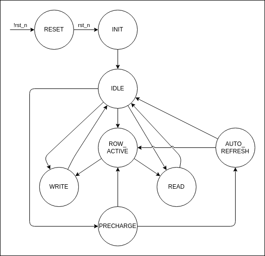

# SDRAM Implementation


- [SDRAM Implementation](#sdram-implementation)
  - [Introduction](#introduction)
  - [Parameters](#parameters)
    - [System Parameters](#system-parameters)
    - [SDRAM Parameters](#sdram-parameters)
  - [Interfaces](#interfaces)
    - [Clock and Reset](#clock-and-reset)
    - [Configuration](#configuration)
    - [System Bus Interface](#system-bus-interface)
    - [SDRAM Interface](#sdram-interface)
  - [Design Implementation: Common Logic](#design-implementation-common-logic)
    - [Convert SDRAM timing to clock cycle](#convert-sdram-timing-to-clock-cycle)
    - [SDRAM Init State Machine](#sdram-init-state-machine)
    - [SDRAM Control State Machine](#sdram-control-state-machine)
    - [Handling System Bus](#handling-system-bus)
    - [Read Latency](#read-latency)
    - [Timing Counter](#timing-counter)
  - [Design Variants: sdram\_simple\_ap.sv](#design-variants-sdram_simple_apsv)
    - [Supported Feature](#supported-feature)
    - [Main State Machine](#main-state-machine)
    - [Implementation Note](#implementation-note)
  - [Design Variants: sdram\_simple\_mp.sv](#design-variants-sdram_simple_mpsv)
    - [Supported Feature](#supported-feature-1)
    - [Main State Machine](#main-state-machine-1)

## Introduction

This document provides detailed documentation for various SDRAM controller variants implemented in this project.

For general SDRAM behavior, timing, and command descriptions, the Micron SDRAM serves as an excellent reference and covers all the information. This document does not attempt to replicate that information. However, some key SDRAM information will be provided in here as a reference.

The focus is on the specific implementation details, design decisions, and feature trade-offs made in each SDRAM variant included in this repository.

## Parameters

### System Parameters

| Parameter | Default | Unit | Description                                         |
| --------- | ------- | ---- | --------------------------------------------------- |
| CLK_FREQ  | 100     | MHz  | System clock frequency                              |
| AW        | 24      | bits | Address bus width (matches addressable SDRAM range) |
| DW        | 16      | bits | Data bus width (matches with SDRAM data width)      |

### SDRAM Parameters

**SDRAM Size**

| Parameter | Default | Unit | Description                       |
| --------- | ------- | ---- | --------------------------------- |
| RAW       | 12      | bits | Row address width of the SDRAM    |
| CAW       | 9       | bits | Column address width of the SDRAM |

**SDRAM Timing**

| Parameter | Default | Unit | Description                                         |
| --------- | ------- | ---- | --------------------------------------------------- |
| tRAS      | 42      | ns   | ACTIVE to PRECHARGE command time                    |
| tRC       | 60      | ns   | ACTIVE to ACTIVE command period                     |
| tRCD      | 18      | ns   | ACTIVE to READ or WRITE delay                       |
| tRFC      | 60      | ns   | AUTO REFRESH command period                         |
| tRP       | 18      | ns   | PRECHARGE command period                            |
| tRRD      | 20      | ns   | ACTIVE to ACTIVE delay between different banks      |
| tWR       | 20      | ns   | WRITE recovery time (WRITE completion to PRECHARGE) |
| tREF      | 64      | ms   | Refresh period (time to refresh all rows)           |

## Interfaces

### Clock and Reset

| Signal Name | Direction | Width | Description              |
| ----------- | --------- | ----- | ------------------------ |
| clk         | Input     | 1     | System clock.            |
| rst_n       | Input     | 1     | Active-low reset signal. |

### Configuration

| Signal Name      | Direction | Width  | Description                                              |
| ---------------- | --------- | ------ | -------------------------------------------------------- |
| cfg_burst_length | Input     | 3 bits | SDRAM mode register: Burst length                        |
| cfg_burst_type   | Input     | 1 bit  | SDRAM mode register: Burst type (sequential/interleaved) |
| cfg_cas_latency  | Input     | 3 bits | SDRAM mode register: CAS latency                         |
| cfg_burst_mode   | Input     | 1 bit  | SDRAM mode register: Write burst mode (single/full)      |


### System Bus Interface

| Signal         | Direction | Width | Description                                |
| -------------- | --------- | ----- | ------------------------------------------ |
| bus_read       | Input     | 1     | Read request                               |
| bus_write      | Input     | 1     | Write request                              |
| bus_addr       | Input     | AW    | Address for read/write                     |
| bus_burst      | Input     | 1     | Indicates if the transfer is a burst       |
| bus_burst_len  | Input     | 3     | Burst length                               |
| bus_wdata      | Input     | DW    | Write data                                 |
| bus_byteenable | Input     | DW/8  | Byte-wise write enable mask                |
| bus_ready      | Output    | 1     | Controller is ready to accept new requests |
| bus_rvalid     | Output    | 1     | Read data is valid                         |
| bus_rdata      | Output    | DW    | Read data returned from SDRAM              |

Note:
 - bus_burst/bus_burst_len are only used when burst feature is supported

### SDRAM Interface

| Name        | Type   | Width | Function                           |
| ----------- | ------ | ----- | ---------------------------------- |
| sdram_clk   | Output | 1     | SDRAM Clock                        |
| sdram_cke   | Output | 1     | Clock Enable. High active.         |
| sdram_cs_n  | Output | 1     | Chip Select. Low active.           |
| sdram_ras_n | Output | 1     | Row Address Select. Low active.    |
| sdram_cas_n | Output | 1     | Column Address Select. Low active. |
| sdram_we_n  | Output | 1     | Write Enable. Low active.          |
| sdram_addr  | Output | AW    | ROW or COL Address                 |
| sdram_ba    | Output | 2     | Bank Address.                      |
| sdram_dqm   | Output | DW/8  | DQ Mask.                           |
| sdram_dq    | inout  | DW    | DQ. Data Input/Output bus          |

Note:
- sdram_ba: only support 4 bank right now


## Design Implementation: Common Logic

This section describe implementation common to all the variants.

### Convert SDRAM timing to clock cycle

The SDRAM timing parameter is converted from ns to the clock cycle.

```verilog
// Calculate the SDRAM timing in terms of number of clock cycle
localparam cRAS = ceil_div(tRAS * CLK_FREQ, 1000);      // (CLK Cycle) ACTIVE-to-PRECHARGE command
localparam cRC  = ceil_div(tRC  * CLK_FREQ, 1000);      // (CLK Cycle) ACTIVE-to-ACTIVE command period
localparam cRCD = ceil_div(tRCD * CLK_FREQ, 1000);      // (CLK Cycle) ACTIVE-to-READ or WRITE delay
localparam cRFC = ceil_div(tRFC * CLK_FREQ, 1000);      // (CLK Cycle) AUTO REFRESH period
localparam cRP  = ceil_div(tRP  * CLK_FREQ, 1000);      // (CLK Cycle) PRECHARGE command period
localparam cRRD = ceil_div(tRRD * CLK_FREQ, 1000);      // (CLK Cycle) ACTIVE bank a to ACTIVE bank b command
localparam cWR  = ceil_div(tWR  * CLK_FREQ, 1000);      // (CLK Cycle) WRITE recovery time (WRITE completion to PRECHARGE period)
```

### SDRAM Init State Machine

SDRAM must be initialized properly after powered up before it can operate.

Here is the power-up sequence used in this design:

1. Apply power to SDRAM and hold CKE low.
2. Provide stable SDRAM clock signal.
3. Bring CKE HIGH and then wait at least 100us prior to issuing any command except **COMMAND INHIBIT** or **NOP**.
4. Perform a **RECHARGE ALL** command and wait for its completion.
5. Perform an **AUTO REFRESH** command and wait for its completion.
5. Perform an **AUTO REFRESH** command and wait for its completion.
6. Perform a **Load Mode Register** Command and wait for its completion.
7. SDRAM is ready for operation.

A SDRAM init state machine controls the initialization sequence. **All the SDRAM variants use the same state machine.**

**State Definition in RTL**

```verilog
// SDRAM Initialization State Machine
typedef enum logic [3:0] {
    INIT_IDLE,          // start up idle state
    INIT_WAIT,          // wait at least 100us
    INIT_PRECHARGE,     // perform: precharge all the bank
    INIT_AUTO_REF0,     // perform: First Auto refresh
    INIT_AUTO_REF1,     // perform: Second Auto refresh
    INIT_SET_MODE_REG,  // perform: Set mode register
    INIT_DONE           // Initialization done
} sdram_init_state_t;
```

**State Diagram**


**State Transition**

The SDRAM init state machine follows the initialization sequence. After each command completes and its required timing is satisfied, the controller transitions to the next state in the sequence.

In the **WAIT** state, an `ir_cnt` counter measures the 100 µs delay required after power-up.
The signal `ir_cnt_zero is` asserted when this delay is complete (ir_cnt reaches zero), triggering the transition to the next state.

In the other states, a `cmd_cnt` counter measures command-specific timing requirements (e.g., tRP, tRFC, tMRD).
The signal `cmd_cpl` is asserted when the counter expires, allowing the state machine to proceed to the next operation.

When entering each state, the corresponding SDRAM commands are send to the SDRAM to perform the initialization.

The corresponding logic can be found in RTL under the session commented with: ```// Init state machine```

### SDRAM Control State Machine

The SDRAM control state machine manages the sequencing of SDRAM operations by issuing the appropriate commands to the SDRAM chip. Different variants of the SDRAM controller may implement different state machines to support various features (e.g., burst read/write, auto-precharge).

In the RTL, the state machine is organized into three main sections:

1. State Transition Arcs: `arc_<state_0>_to_<state_1>`

    - The state transition arc defines the state transition condition from one state to another state.
    - Example:

        ```verilog
        // RESET -> INIT: Start SDRAM initialization sequence once coming out of reset
        assign arc_RESET_to_INIT = s_RESET;
        // INIT -> IDLE: Initialization complete
        assign arc_INIT_to_IDLE = s_INIT & (init_state == INIT_DONE);
        ```

2. State Transition Logic

    - Using the state transaction arc to control the state transition.
    - Example:

        ```verilog
        always_comb begin
            case(1)
                arc_RESET_to_INIT:                  sdram_state_n = SDRAM_INIT;
                arc_INIT_to_IDLE:                   sdram_state_n = SDRAM_IDLE;
                ...
            endcase
        end
        ```

3. Output function logic

    - Generate control signals for both:
      - the internal control (counters, data capture, bus control)
      - sdram control signals (cs_n, ras_n, cas_n, we_n, addr, dq, etc.)
    - The RTL can be found under session commented with `// SDRAM State Machine Output Function Logic`


### Handling System Bus

**Input/Output Register**

The incoming bus requests are first captured into internal register (`int_bus_*`) before being processed by the
SDRAM control state machine. This help achieve cleaner and faster timing on the interface.

Similarly, the read data from the SDRAM is also registered before sending back to the host.

The corresponding logic can be found in RTL under the session commented with: ```// Handling system bus```

### Read Latency

In this design, it is assumed that the SDRAM latches incoming control signals near the end of each clock cycle.
As a result, the actual read latency observed externally becomes:

```
read_latency = config_cas_latency (CL) + 1
```

This additional cycle accounts for the time it takes for the SDRAM to receives the command.

> ⚠️ Note:
> The total latency of a read request is longer than just read_latency, because it also includes the delay required to activate the row before issuing the READ command (typically tRCD cycles).

### Timing Counter

The SDRAM controller uses several counters to meet SDRAM timing requirements during initialization, refresh, and command execution phases.

#### Init / Refresh Counter (`ir_cnt`)
- During power-up, ir_cnt counts the required 100 µs delay before SDRAM can be initialized.
- During normal operation, it tracks the interval between periodic Auto Refresh commands.
- To save resources, both use cases share the same counter register: `ir_cnt`.
- When counter reaches zero, `ir_cnt_zero` is asserted to indicate the time interval has been reached.

#### Command Counter (`cmd_cnt`)

- The command counter enforces command-specific timing requirements such as tRP, tRFC, and tMRD converted to clock cycle.
- When a new command is issued, cmd_cnt is loaded with the corresponding wait period (in clock cycles) for that command.
- When counter reaches zero, `cmd_cpl` is asserted to indicate the command is completed and meet required timing.

#### Read Latency Counter (`read_latency_cnt`)

The read latency counter measures the number of clock cycle between when the READ command is issued and when the first data is available on the `SDRAM_DQ` bus.

#### Example timing diagram

Here is a timing diagram showing a **single read request** with CAS Latency (CL) = 2 and 50MHz Clock Frequency:


- A: The read request is accepted and captured into SDRAM internal register.
- B: The ROW ACTIVE command is issued. `cmd_cnt` is loaded with 0 as it takes one cycle to complete the command.
- C: The READ with Auto Precharge command is issued to SDRAM chip (aligned with SDRAM controller's internal clock).
    - `cmd_cnt` is loaded with 3 as it takes 4 cycle to complete the command. (3~0 count 4 cycles).
    - `read_latency_cnt` is loaded with 2 as `read_latency = 3`
- D: The READ command is captured by the SDRAM chip on rising edge of `sdram_clk`.
- E: The read data becomes available on the `sdram_dq` bus after CAS Latency. (CL = 2).
- F: The SDRAM controller captures the read data and returns it to the host system.
- G: The READ with Auto Precharge command is completed.

## Design Variants: sdram_simple_ap.sv

This section describe implementation for sdram_simple_ap.sv variant.

### Supported Feature

- Single read/write with Auto Precharge.
- No burst support.

### Main State Machine

#### State Definition in RTL

```verilog
// SDRAM Main Control State Machine
typedef enum logic [3:0] {
    SDRAM_RESET,              // Start up State
    SDRAM_INIT,               // SDRAM initialization
    SDRAM_IDLE,               // IDLE state (after bank have been pre-charged)
    SDRAM_ROW_ACTIVE,         // Active a row
    SDRAM_WRITE_A,            // Write with auto precharge
    SDRAM_READ_A,             // Read with auto precharge
    SDRAM_AUTO_REFRESH        // Auto Refresh
} sdram_state_t;
```

**State Transition Diagram**


This state machine manages the control flow of SDRAM operations, including initialization, refresh, read, and write cycles. The transitions are driven by input control signals and completion flags indicating when each stage of an operation is finished.

**States and Transitions**

- RESET
  - Entered when the system is reset.
  - Transitions to INIT upon de-assertion of reset (rst_n).

- INIT
  - Performs SDRAM initialization sequence.
  - Transitions to IDLE when the internal init state (init_state) reaches INIT_DONE.

- IDLE
  - Waits for a bus request or refresh trigger.
  - Transitions to:
    - AUTO_REFRESH if `ir_cnt_zero` is asserted (refresh interval reached).
    - ROW_ACTIVE if a bus request is pending (`int_bus_req`) and `ir_cnt_zero` is de-asserted (i.e., not in refresh period).

- AUTO_REFRESH
  - Issues a REFRESH command to the SDRAM.
  - Returns to IDLE once the command completes (`cRFC`).

- ROW_ACTIVE
  - Issues a ROW ACTIVE command to activates the appropriate SDRAM row for read/write access.
  - Transitions to:
    - READ_A if the request is a read (`int_bus_read`).
    - WRITE_A if the request is a write (`int_bus_write`).
  - Transitions after the Row Active command complete (`cRCD`).

- READ_A
  - Issue READ with Auto Precharge command.
  - Returns to IDLE after the command completes (`cRC - cRCD`).
  - tRC count from ROW ACTIVE to Auto Precharge complete, so the time spend in READ with Auto Precharge command is `tRC - tRCD`

- WRITE_A
  - Issue WRITE with Auto Precharge command.
  - Returns to IDLE after the command completes (`cRC - cRCD`).

### Implementation Note

#### Handling Pending Requests When SDRAM is Busy

When the SDRAM controller is accessing the SDRAM chip for the current request, it de-asserts the `bus_ready` signal to
indicate the host it is busy and not able to take a new request.

To support back-to-back request efficiently, the controller is designed to assert the `bus_ready` signal again at the last
cycle of `READ_A` and `WRITE_A` state. So the next request (if any) can be accepted immediately after the current operation
completes, and captured into the internal register as the controller transitions to the `IDLE` state. Once in the IDLE state,
the state machine can immediately proceed to issue a `ROW ACTIVE` command for the next operation.

In this design, all output signals including `bus_ready` are registered. To ensure `bus_ready` is asserted at the correct time, the internal combinational version of the signal, named `int_bus_ready`, is asserted one cycle before the last cycle of the `READ_A` and `WRITE_A` states.

Example Waveform:


- A: A new write request is accepted.
- B: `int_bus_ready` is asserted one cycle before the `WRITE_A` command complete.
- C: `bus_ready` is asserted at the last cycle of `WRITE_A`. The next read request is accepted at the end of the cycle.
- D: The read request is captured in the internal register.
- E: `int_bus_ready` is asserted one cycle before the `READ_A` command complete.
- F: `bus_ready` is asserted at the last cycle of `READ_A`.

## Design Variants: sdram_simple_mp.sv

This section describe implementation for sdram_simple_mp.sv variant.

### Supported Feature

- Single read/write. No burst support.
- **Manual precharge.**

### Main State Machine

#### State Definition in RTL

```verilog
typedef enum logic [3:0] {
    SDRAM_RESET,              // Start up State
    SDRAM_INIT,               // SDRAM initialization
    SDRAM_MODE_REG_SET,       // Mode Register set
    SDRAM_IDLE,               // IDLE state (after bank have been pre-charged)
    SDRAM_ROW_ACTIVE,         // Active a row
    SDRAM_WRITE,              // Write without auto precharge
    SDRAM_READ,               // Read without auto precharge
    SDRAM_PRECHARGE,          // Precharge the bank
    SDRAM_AUTO_REFRESH        // Auto Refresh
} sdram_state_t;
```

**State Transition Diagram**




**States and Transitions**

- RESET
  - Entered when the system is reset.
  - Transitions to INIT upon de-assertion of reset (rst_n).

- INIT
  - Performs SDRAM initialization sequence.
  - Transitions to IDLE when the internal init state (init_state) reaches INIT_DONE.

- IDLE
  - Waits for a bus request or refresh trigger.
  - Transitions to:
    - ROW_ACTIVE: `Not refresh pending` AND `New request registered` AND `Bank precharged`.
    - WRITE:      `Not refresh pending` AND `New write request registered` AND `No need to open a new row`.
    - READ:       `Not refresh pending` AND `New read  request registered` AND `No need to open a new row`.
    - AUTO_REFRESH: `refresh pending` OR (`new bus request registered` AND `Need to open a new row`)

- ROW_ACTIVE
  - Issues a ROW ACTIVE command to activates the appropriate SDRAM row for read/write access.
  - Transitions to:
    - READ:  `Row Active command complete (tRCD)` AND `Read request registered`.
    - WRITE: `Row Active command complete (tRCD)` AND `Write request registered`.

- AUTO_REFRESH
  - Issues a REFRESH command to the SDRAM.
  - Transitions to:
    - IDLE: `Auto Refresh command complete (tRFC)` AND `No request registered`.
    - ROW_ACTIVE: `Auto Refresh command complete (tRFC)` AND `New request registered`.

- PRECHARGE
  - Issues a REFRESH command to the SDRAM.
  - Transitions to:
    - AUTO_REFRESH: `Precharge command complete (tRP)` AND `Refresh pending`.
    - ROW_ACTIVE: `Precharge command complete (tRP)` AND `Not refresh pending`.

- READ_A
  - Issue READ command.
  - Transitions to:
    - IDLE: `Read command complete (RL+1).`

- WRITE_A
  - Issue WRITE command.
  - Transitions to:
    - IDLE: `Write command complete (tWR).`

Note:
  - `open a new row` is defined as the current {bank, row} != previous {bank, row}
